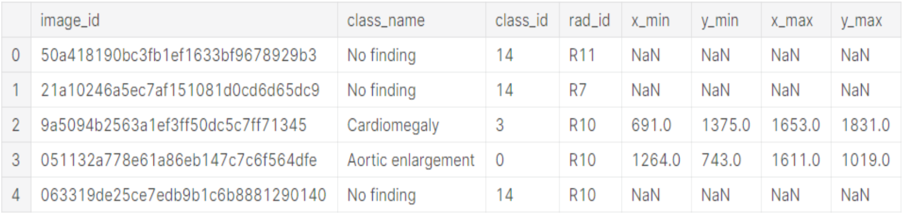
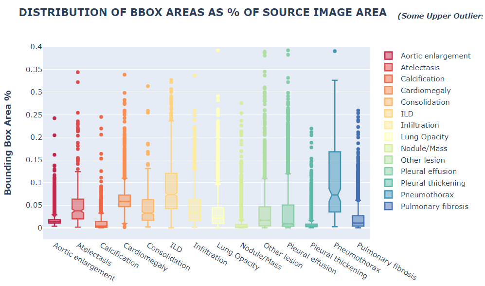

# Abnormality Detection in Chest X-rays (CXR)

Amna Gul, Sheldon Sebastian

Photo by <a href="https://unsplash.com/@nci?utm_source=unsplash&utm_medium=referral&utm_content=creditCopyText">National Cancer Institute</a> on <a href="https://unsplash.com/s/photos/radiologist?utm_source=unsplash&utm_medium=referral&utm_content=creditCopyText">Unsplash</a>

## Abstract

 

Deep learning has played a crucial role in advancing the field of health care especially for analyzing images. However, within the healthcare domain, automatic detection of abnormalities in Chest X-Rays (CXRs) is an area where very limited research has been done. So the goal of this project is to provide doctors with computer-aided diagnostic assistance to locate common lung diseases. 

  

<i>Keywords</i>: Computer Vision, Deep Learning, Object Detection, Chest X-rays

## Video Presentation

## Table of Contents:

- Introduction
    - Problem Statement 
    - Problem Elaboration	
    - Project Scope
- Literature Review
- Methodology	
  - Data Collection	
  - Dataset Description	
  - Exploratory Data Analysis	
  - Data Preprocessing	
  - Modeling	
- Results & Analysis	
- Conclusion	
  - Project Limitation	
  - Future Work	
- References	
- Appendix	

## Introduction

### Problem Statement

Conventional methods of manual CXR prognosis have many limitations, for example not only is it slow and costly but can also lead to misdiagnosis caused by poor human judgment. To address this problem, machine learning models can be used to classify and identify the location of abnormalities in CXRs. Such computer-aided diagnosis can help reduce the pressure on doctors and improve diagnostic quality by providing swift and accurate assessments about a patient’s condition.

### Problem Elaboration

Innumerable abnormalities can be present in CXRs but we focused only on the 14 most common thoracic diseases and assigned a numerical value to each of them from 0-13. 

Names, as well as class IDs of these abnormalities, are listed below:

| Class Id | Class Name |
| ---------| -----------|
| 0 | Aortic enlargement |
| 1 | Atelectasis |
| 2 | Calcification |
| 3 | Cardiomegaly |
| 4 | Consolidation |
| 5 | ILD |
| 6 | Infiltration |
| 7 | Lung Opacity |
| 8 | Nodule/Mass |
| 9 | Other lesions |
| 10|  Pleural effusion |
| 11|  Pleural thickening |
| 12|  Pneumothorax |
| 13|  Pulmonary fibrosis |

If none of the above-mentioned diseases are found in a CXR, then it will be assigned to the 
<b>“14 - No Finding”</b> class category i.e. healthy patient’s CXR. 

### Project Scope

The scope of our project is passing a raw CXR image to our trained machine learning model(s) and get predicted abnormality detection bounding boxes overlaid on top of it as output (as shown below in Fig 1).

Figure 1

 

The above workflow diagram provides a high-level overview of tasks that we have performed on our project from start to finish. We first pre-processed the raw data and performed exploratory data analysis on it. The pre-processed data was used for training binary classification models and object detection models. The output of all models were ensembled and based on the best validation ensembling strategy, submissions were made on Kaggle. The details of each task will be discussed in upcoming sections.

## Literature Review

To understand how the original data was collected we read “VinDr-CXR: An Open Dataset of Chest X-Rays With radiologist’s Annotations”[4]. Once we understood how the data was collected, we shortlisted which object detection models to use based on “Deep Neural Network Ensemble for Pneumonia Localization from a Large-Scale Chest x-Ray Database”[6]. To narrow down the models to use for classifying healthy or unhealthy chest X-rays, we referred to “Tuberculosis diagnostics and localization in chest x-rays via deep learning models”[7]. We used the “Weighted Boxes Fusion: Ensembling Boxes for Object Detection Models”[5] method to ensemble object detection models by averaging the bounding boxes and confidence scores.

## Methodology

### Data Collection

The original dataset consists of 18,000 CXR scans (in DICOM format) collected from two major hospitals in Vietnam and made publicly available as part of a Kaggle competition[1]. A total of 17 different radiologists were involved in manually annotating this dataset. The entire dataset was further divided into a training set of 15,000 images and a test set of 3,000 images. Each scan in the training set was independently labeled by 3 radiologists while each scan in the test set was labeled by consensus of 5 radiologists.

[comment]: <> (![]&#40;saved_images/data_collection.png&#41;)

### Dataset Description

The 15,000 training set images have an accompanying CSV file that has the following 8 columns as shown below in Figure 2:

Figure 2

Each row contains information about a single annotation made by a single radiologist on a single image. Furthermore, each image appears at least 3 times in the image_id column because each image was independently labeled by 3 different radiologists. 

The description of each column is given below:

|Column Name| Column Description |
|---------|------------------------|
|image_id| unique image identifier |
|class_name| name of abnormality present in a specific image |
|class_id| unique numerical ID (from 0 - 14) assigned to each class in the dataset |
|rad_id | ID of the radiologist (from 1 - 17) that annotated that image |
|x_min, y_min, x_max, y_max| The last 4 columns contain the bounding box coordinate information for the exact location of the abnormality in an image where (x_min, y_min) tuple represents top left corner and (x_max, y_max) tuple represents bottom right corner of the bounding box.   For the “No Finding” class, these columns have NaNs as placeholders. |

A sample image (and its corresponding annotations) from the training dataset is given below:

Figure 3

### Exploratory Data Analysis

Before diving deep into the modeling stage, first, we explored our dataset to gather meaningful insights from quantitative data. 
The total number of annotations in the dataset is 67,914. The bar chart in Figure 4, shows the distribution of these annotations on a per-class basis. It can be observed that the “No finding” class has the highest (~31,000) number of annotations whereas the “Pneumothorax” class has the least number of annotations (226). So overall the dataset that we are dealing with is highly imbalanced.   

Figure 4[2]

Figure 5 below shows that 
<ul>
<li> 3 of the radiologists (R9, R10, & R8 in that order) are responsible for the vast majority of annotations (~60% of all annotations)</li>
<li> Among the other 14 radiologists, there is some variation around the number of annotations made, however, these 14 radiologists all made between 3121 annotations and 812 annotations</li>
</ul>

Figure 5[2]

Figure 6 below was created using bounding box information of each class to identify the approximate location of each abnormality. It can be observed that:
<ul>
<li>Aortic Enlargement is found to be near the aortic vein (above the heart)</li>
<li>For Cardiomegaly (heart disease), the distribution is concentrated close to bottom corner of the chest</li> 
<li>For all remaining abnormalities, the distribution is lung shaped and relatively diffused</li>
</ul>

Figure 6[2]

Further investigating the bounding box statistics per class, a box plot (Figure 7) was created that shows the distribution of bounding box areas as percentage of total image area. It can be observed that on average, “Pneumothorax” has the largest bounding boxes whereas “Nodule/Mass” has the smallest bounding boxes.

Figure 7[2]

### Data Preprocessing

The following preprocessing steps were performed before passing data to deep learning models:
<ul>
<li> Converting images from DICOM to png format</li>
<li> Reducing total dataset size from ~191 GB to ~2.3 GB</li>
<li> Resizing images as well as their corresponding bounding boxes to 512 x 512 dimension</li>
<li> Converting single-channel images to RGB channels</li>
<li> Splitting train data into stratified train-holdout sets (as shown in Figure 8) to evaluate model performance</li>
</ul>

Figure 8

### Modeling

After performing stratified splitting of data we trained the following models:
<ol>
<li> Resnet152 </li>
<li> VGG19 </li>
<li> Faster RCNN </li>
<li> YOLOv5 </li>
</ol>

Resnet152 and VGG19 were used to classify whether the CXR is healthy or unhealthy and Faster RCNN and YOLOv5 were used for abnormality detection of 14 thoracic diseases. For evaluating the classification models we used <b>F1 score</b> and for evaluating object detection models we used <b>mean average precision (mAP) with IoU of 0.4.</b>

#### Resnet152 and VGG19:

Resnet152 and VGG19 models were created using PyTorch and trained using pretrained weights[8]. The models were trained for 5 epochs with all the layers frozen except the last layer and then were trained for additional 25 epochs with all layers unfrozen and with a reduced learning rate[7].  

The final layer had a single neuron that would specify whether the CXR is healthy or unhealthy. The loss function used to train the models was BCEWithLogitsLoss[9]. To handle the class imbalance, the minority unhealthy CXR class was oversampled, and additionally, class weights were used in the loss function[20].  

The training data and validation data were normalized using ImageNet statistics. When training the models to avoid overfitting, the following augmentations from the albumentations[21] package were applied for the training dataset:
<ul>
<li> RandomBrightnessContrast(p=0.3) </li>
<li> ShiftScaleRotate(rotate_limit=5, p=0.4) </li>
<li> HorizontalFlip(p=0.4) </li>
</ul>
The batch size used during training was 8 and the optimizer used was Adam with an initial learning rate of 0.01 and then a reduced learning rate of 0.0001. Only the model with the lowest validation loss was saved.

#### Faster RCNN:

Faster RCNN is a two-stage object detector where it first finds regions of interest and then classifies them. Faster RCNN model was created using the detectron2[10] framework and was trained using pretrained backbone Resnet101 with FPN[11].   

The model was trained for 30 epochs and the model state was saved periodically. The last epoch model was the best performing model. Stochastic gradient descent was used as optimizer with a base learning rate of 0.001. The learning rate scheduler used was warmup cosine and the batch size was 2.   

To identify abnormalities of various sizes custom anchor sizes of 2, 4, 8, 16, 32, 64, 128, 256 and 512 were used with aspect ratio of 0.33, 0.5, 1.0, 2.0 and 2.5. The augmentations used for the training dataset are as follows:
<ul>
<li> HorizontalFlip(p=0.5) </li>
<li> RandomBrightnessContrast(p=0.5) </li>
<li> ShiftScaleRotate(scale_limit=0.15, rotate_limit=0, p=0.5) </li>
</ul>
To handle the class imbalance in object detection models, external dataset from NIH was used[12][14] to add more data to the minority classes. RepeatFactorTrainingSampler[13] with threshold 1000 was used to oversample the minority classes. This gave a very minimal performance boost.

#### YOLOv5:

YOLOv5[16][17] is a single-stage detector based on PyTorch framework. The bounding box data was converted to be compatible with the YOLOv5 format (x -mid, y-mid, width, height). For training purposes, the data was split into training and validation datasets. The pretrained yolo5x.pt (largest in YOLO family) model was used.  

By default stochastic gradient descent was used as optimizer and the anchor boxes were automatically learned using k-means and genetic algorithm. The learning rate for training was 0.002 and the batch size was 16. The model was trained using the default YOLOv5 data augmentations for a total of 30 epochs.  

#### Ensembling

<u>Ensembling Classification Models</u>: For Resnet152 and VGG19 classification models, the prediction probabilities were combined by taking their average.  

<u>Ensembling Object Detection Models</u>: To combine the results of Faster RCNN and YOLOv5, weighted boxes fusion(WBF)[5][18] was used with weights of 3:9 respectively. The outputs of Faster RCNN and YOLOv5 were post-processed using NMS with an IoU threshold of 0.3 and a confidence threshold of 0.05. The processed outputs were then fused together using WBF and the fused outputs were again post-processed using NMS with an IoU threshold of 0.3 and a confidence threshold of 0.05  

<u>Ensembling Classification and Object Detection Models</u>: We used thresholding logic[19] (as shown in Figure 9) to ensemble the classification and object detection models instead of a hierarchical approach.   

Figure 9

In Figure 9, the lower threshold was set to 0.05 and the upper threshold was set to 0.95.

The steps for thresholding logic are as follow:

<b>Step 1:</b> If classification model prediction probability (close to 0 means healthy and close to 1 means unhealthy) is less than the lower threshold then use the classification model prediction i.e. No findings class with a 100% confidence score. For example, the below figure shows ground truth vs predicted annotations:

<b>Step 2:</b> If classification model prediction probability is greater than the upper threshold then use the object detection model prediction as is. For example, the below figure shows ground truth vs predicted annotations:

<b>Step 3:</b> If classification model prediction probability is less than the upper threshold but greater than the lower threshold then we add the classification model output i.e. No findings class with classification model prediction probability as confidence score, to the object detection predictions. For example, the below figure shows ground truth vs predicted annotations:

The No Findings class in our dataset is a 1x1 pixel in the top left corner of the image. Thus we need to predict a 1x1 if a chest x-ray is healthy. Using the thresholding logic, mAP of the No Findings class improved from <b>0.1368 to 0.9582</b> thus improving the overall mAP from <b>0.1979 to 0.2903</b>

## Results & Analysis

With the help of transfer learning and class imbalance handling techniques, the classification models were able to distinguish between healthy and unhealthy images with a very high F1 score of approximately 90%. On the other hand, the highest mAP value obtained through object detection models was 0.19 which got increased to 0.29 after applying threshold logic for the “No finding” class.  
The table below summarizes the individual best performance obtained on each of our deep learning models. 

## Conclusion

From the above results, it can be concluded that the ensemble model approach gave the best performance with a boost of almost 50% on the holdout set.   

To further validate our results, 3000 test dataset images were passed through our model and final predictions were submitted on Kaggle’s competition page which scored among the <b>top 14%</b> of solutions with mAP of 0.235 on the competition’s private leaderboard.   

Based on the results, our model can potentially serve as a second opinion to doctors in diagnosing abnormalities in Chest X-rays. Further improvements in the model can prove to be a stepping stone for automating abnormality detection in Chest X-rays.  

### Project Limitation

Due to a lack of expertise in the medical domain, it was challenging to perform feature engineering and other related tasks on the dataset as the abnormalities in CXRs are hardly distinguishable to an untrained eye.   

Furthermore, doctors usually consult a patient’s medical history and other demographic metadata before making a prognosis but our dataset did not fully contain that information.  

Also, the dataset consisted of 15,000 images which is not a sufficient quantity to fully train a deep learning model for detecting 14 abnormalities. So we tried collecting CXRs from external sources but almost all of the publicly available CXR datasets we found had labels only for classification instead of object detection.

### Future Work

The following extensions can be added to the current project for future work:
<ul>
<li> Apply cross-validation techniques on individual models for more robust results </li>
<li> Performing feature engineering using insights gained from EDA </li>
<li> Handling class imbalance problem by implementing data augmentation through Generative Adversarial Networks (GANs). </li>
<li> Deploying our best model on web application e.g. Flask to make it more accessible to the outer world </li>
</ul>

## References

1. Kaggle Competition https://www.kaggle.com/c/vinbigdata-chest-xray-abnormalities-detection
 
2. Link to EDA Notebook https://www.kaggle.com/guluna/eda-cxr
 
3. https://www.kaggle.com/sakuraandblackcat/chest-x-ray-knowledges-for-the-14-abnormalities
 
4. Nguyen, Ha Q., and Khanh Lam et al. VinDr-CXR: An Open Dataset of Chest X-Rays With radiologist’s Annotations. Jan. 2021. https://arxiv.org/pdf/2012.15029.pdf
 
5. Solovyev, Roman, and Weimin Wang. Weighted Boxes Fusion: Ensembling Boxes for Object Detection Models. Oct. 2019. https://arxiv.org/abs/1910.13302v1
 
6. Sirazitdinov, Ilyas, et al. “Deep Neural Network Ensemble for Pneumonia Localization from a Large-Scale Chest x-Ray Database.” Computers & Electrical Engineering, vol. 78, Sept. 2019, doi:10.1016/j.compeleceng.2019.08.004. https://www.sciencedirect.com/science/article/abs/pii/S0045790618332890?via=ihub
 
7. Guo, R., Passi, K.; Jain, C. (2020, August 13). Tuberculosis diagnostics and localization in chest x-rays via deep learning models.
https://www.frontiersin.org/articles/10.3389/frai.2020.583427/full
 
8. https://pytorch.org/tutorials/beginner/finetuning_torchvision_models_tutorial.html
 
9. https://pytorch.org/docs/stable/generated/torch.nn.BCEWithLogitsLoss.html
 
10. Yuxin Wu, Alexander Kirillov, Francisco Massa, and Wan-Yen Lo, & Ross Girshick. (2019).
Detectron2. https://github.com/facebookresearch/detectron2.
 
11. https://github.com/facebookresearch/detectron2/blob/master/configs/COCO-Detection/faster_rcnn_R_101_FPN_3x.yaml
 
12. Wang X, Peng Y, Lu L, Lu Z, Bagheri M, Summers RM. ChestX-ray8: Hospital-scale Chest X-ray Database and Benchmarks on Weakly-Supervised Classification and Localization of Common Thorax Diseases. IEEE CVPR 2017,
ChestX-ray8Hospital-ScaleChestCVPR2017_paper.pdf
 
13. https://detectron2.readthedocs.io/en/latest/modules/data.html?highlight=RepeatFactorTrainingSampler#detectron2.data.samplers.RepeatFactorTrainingSampler
 
14. https://www.kaggle.com/nih-chest-xrays/data
 
15. https://www.kaggle.com/guluna/10percent-train-as-test-512images?scriptVersionId=57768659
 
16. Glenn Jocher, Alex Stoken, Jirka Borovec, NanoCode012, Ayush Chaurasia, TaoXie, … Francisco Ingham. (2021, April 11). ultralytics/yolov5: v5.0 - YOLOv5-P6 1280 models, AWS, Supervise.ly and YouTube integrations (Version v5.0). Zenodo.
http://doi.org/10.5281/zenodo.4679653
 
17. https://github.com/ultralytics/yolov5
 
18. https://github.com/ZFTurbo/Weighted-Boxes-Fusion
 
19. https://www.kaggle.com/awsaf49/vinbigdata-2-class-filter
 
20. Tahira Iqbal, Arslan Shaukat, Usman Akram, Zartasha Mustansar, & Yung-Cheol Byun. (2020). A Hybrid VDV Model for Automatic Diagnosis of Pneumothorax using Class-Imbalanced Chest X-rays Dataset.
 
21. Buslaev, A., Iglovikov, V., Khvedchenya, E., Parinov, A., Druzhinin, M., & Kalinin, A. (2020). Albumentations: Fast and Flexible Image Augmentations. Information, 11(2).
 

## Appendix

1. Experimentations:
<ul>
<li> We tried to merge bounding boxes using Weighted Boxes Fusion at different IoU thresholds to decrease the number of bounding box annotations, but it did not give good results. This could possibly be due to the fact that unmerged bounding box annotations acted as pseudo data augmentation.</li>
<li> We explored different models such as Resnet50 for classification task and RetinaNet for object detection task, but they did not perform well.</li>
<li> We preprocessed the CXR images using Contrast Limited Adaptive Histogram Equalization (CLAHE) and Histogram normalization, but they did not give better results and were very computationally expensive.</li>
</ul>
 
2. Link to all code files:

 https://github.com/sheldonsebastian/vbd_cxr
 
 
3. Link to download trained model files:

 https://www.kaggle.com/sheldonsebastian/vbd-cxr-files

